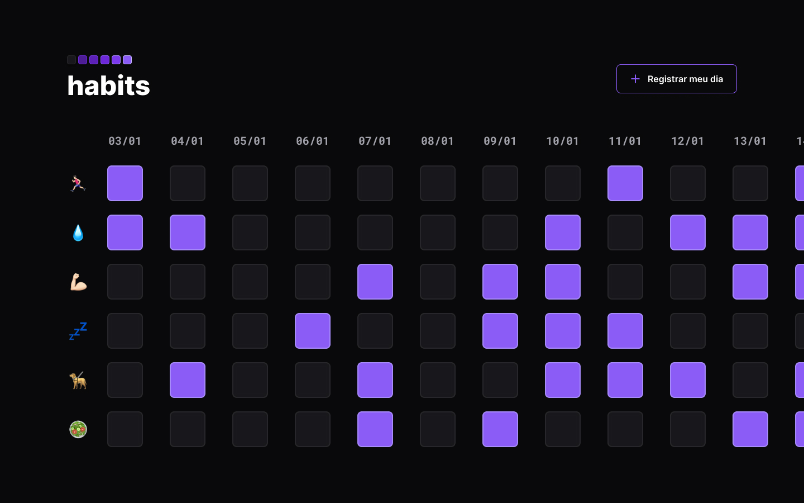

<h1> Projeto NLW Habits<h1>

Este projeto foi desenvolvido na semana NLW, no curso explorer da Rocketseat.O Habist é um app para ajudar a rastrear os hábitos diários.

<h2>🛠️ Construído com</h2>

<ul>
<li>HTML</li>
<li>CSS</li>
<li>Javascript</li>
</ul>

 

Acesso ao app online: https://ayratan.github.io/nlwSetup

<h2>Funcionalidades</h2>

O projeto possui o objetivo de permitir o registro de atividades realizadas durante o presente dia(clicando com o mouse no botão "Registrar o meu dia", ele também permite ao usuário selecionar as atividades realizadas dentre as opções já existentes, marcando-as como realizadas ou não.

Atualmente o projeto salva apenas na maquina local as informações

<h2>Melhorias Futuras</h2>
<ul>
<li>Permitir registrar datas de acordo com a vontade do usuário e não apenas a data atual</li>
<li>Permitir a exclusão de dias</li>
<li>Permitir adicionar novas atividades para serem registradas</li>
<li>Utilizar banco de dados real para armazenamento de informações</li>
</ul>
